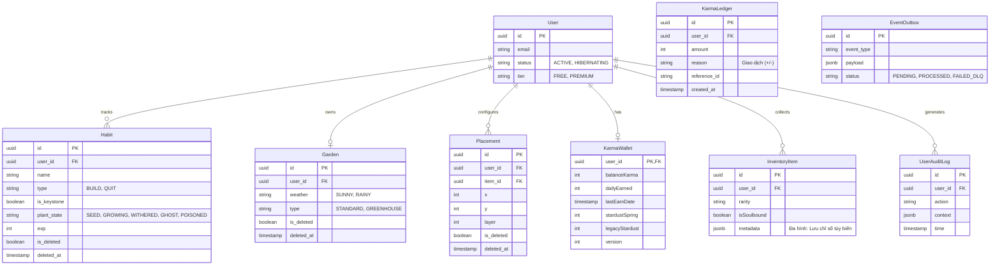
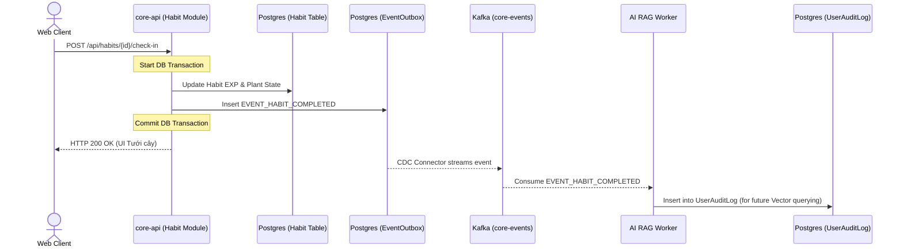
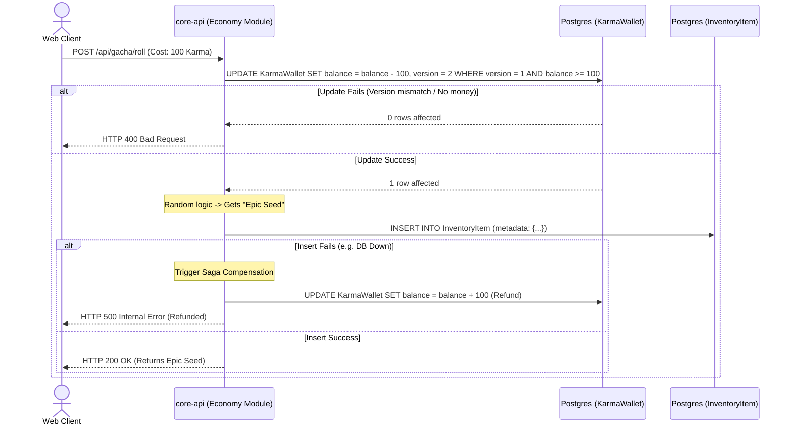
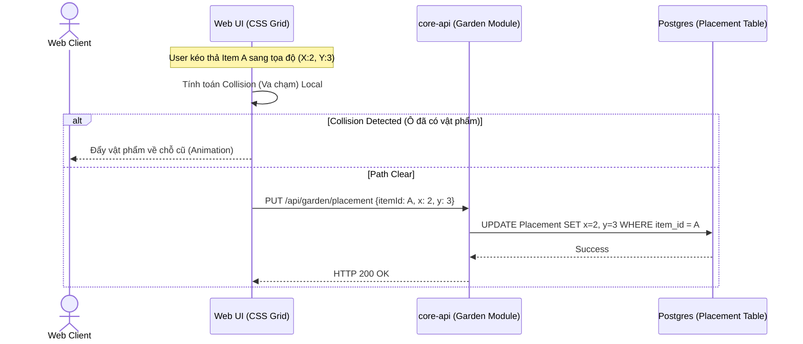
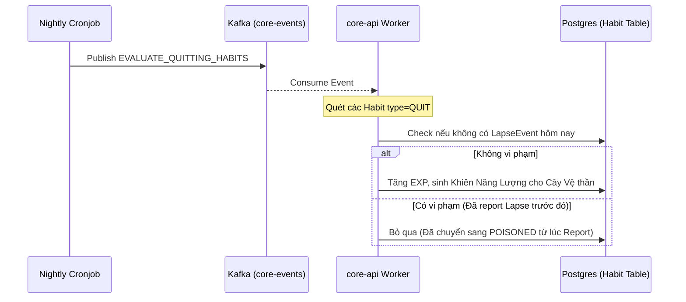

# 🏗️ SYSTEM ARCHITECTURE & TECHNICAL SPECIFICATIONS (GrowthGarden V2)

Tài liệu này biểu diễn Luồng Dữ liệu (Data Flow) và Sơ đồ CSDL (Physical Schema) dựa trên kiến trúc Web-First, Modular Monolith và Event-Driven.

---

## 1. CORE ENTITY RELATIONSHIP DIAGRAM (ERD)

Mô tả sự cô lập dữ liệu theo các Context đã định nghĩa trong lược đồ Prisma.

---

## 2. SEQUENCE DIAGRAMS (LUỒNG DỮ LIỆU CẤP THẤP)

### Luồng 1: Hoàn thành Thói quen & Tách rời Dữ liệu AI (Outbox Pattern)
Bảo vệ Transaction của Habit, đồng thời cung cấp dữ liệu cho AI rảnh tay xử lý.

---

### Luồng 2: Saga Pattern - Quay Gacha (Chống Double-Spending)
Luồng mua vật phẩm sử dụng Optimistic Locking và Saga Compensating Transaction.

---

### Luồng 3: Cập nhật Tọa độ Isometric Garden
Web Client kéo thả HTML5 và gửi tọa độ để lưu vào DB.

---

### Luồng 4: Tính điểm Thói quen Từ bỏ (Quitting Habit) lúc 00:00
Cronjob chạy để thưởng cho user nếu không vi phạm (không gọi hàm Lapse) trong ngày.

