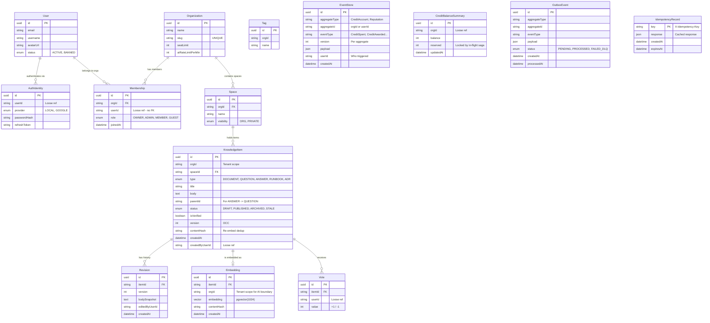
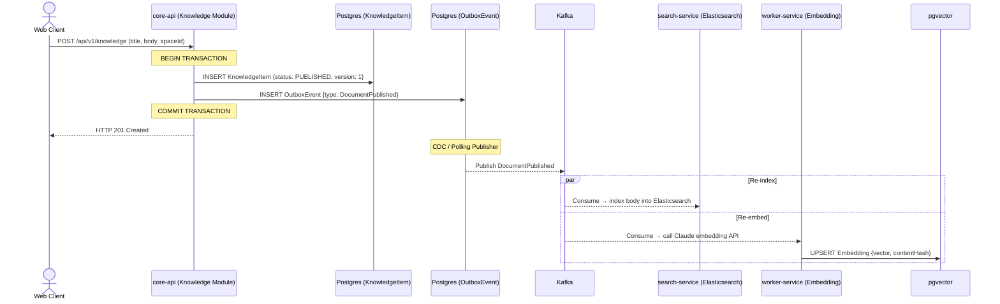
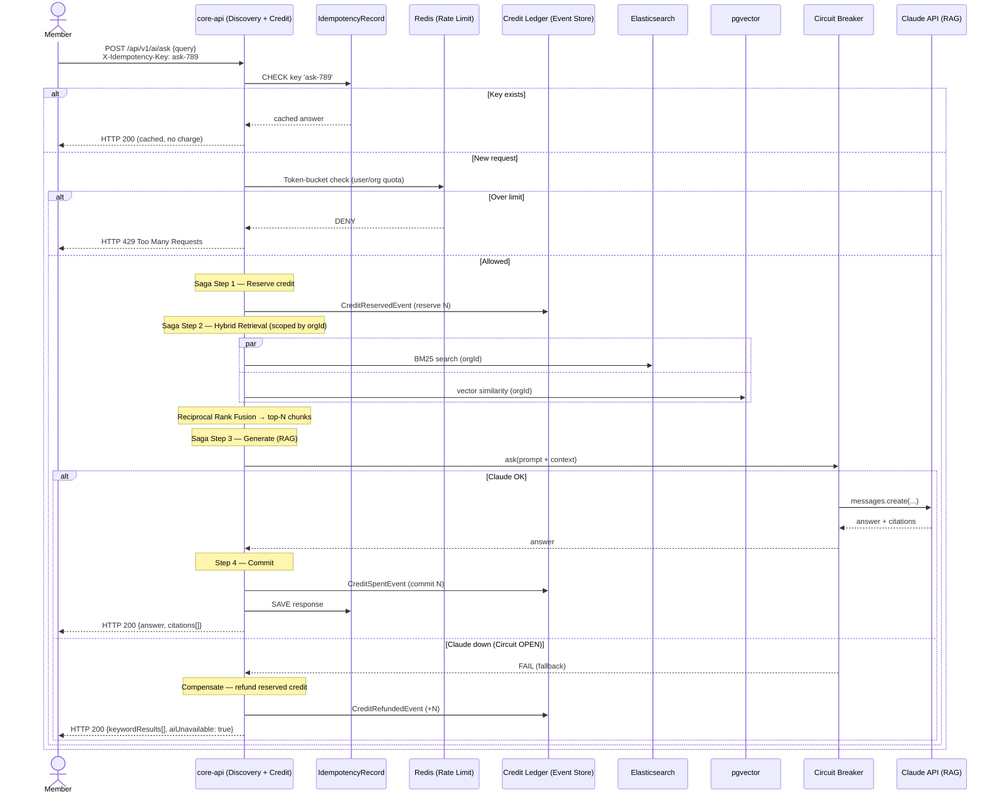
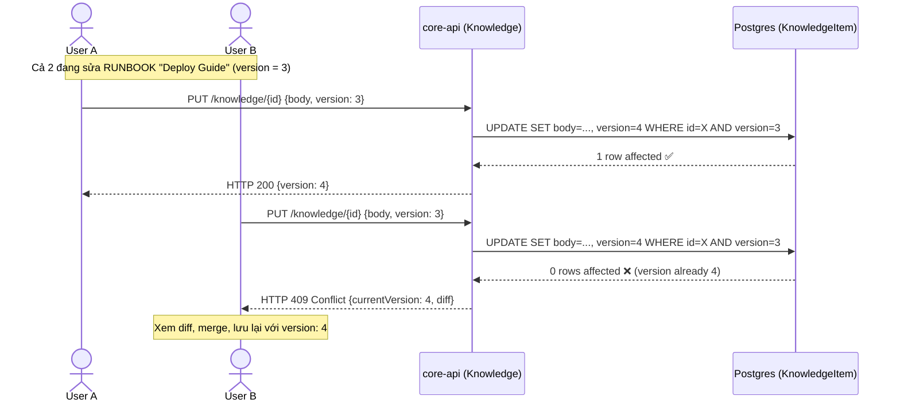
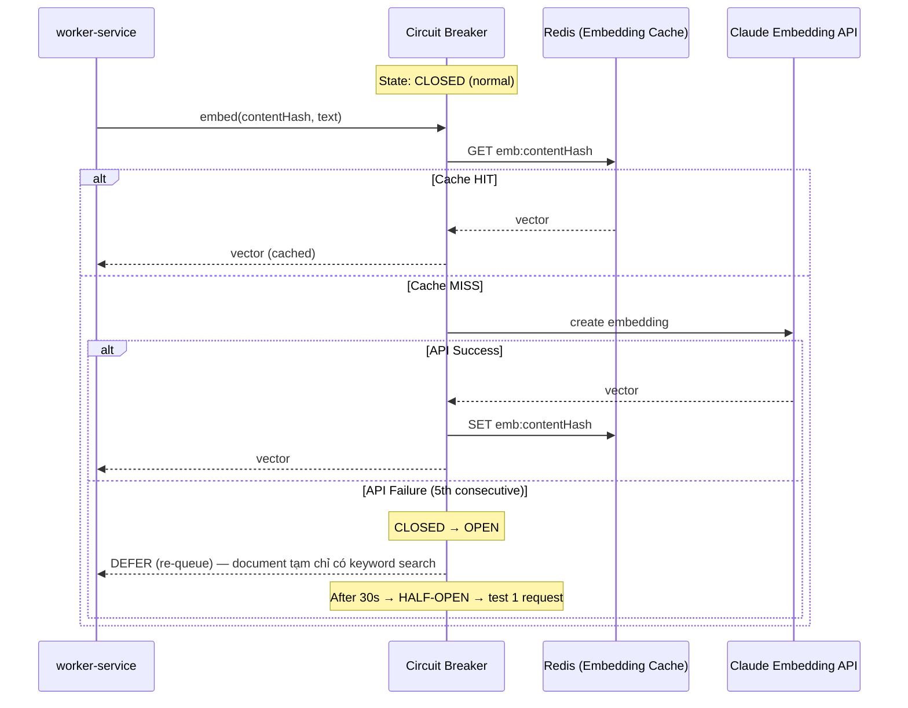
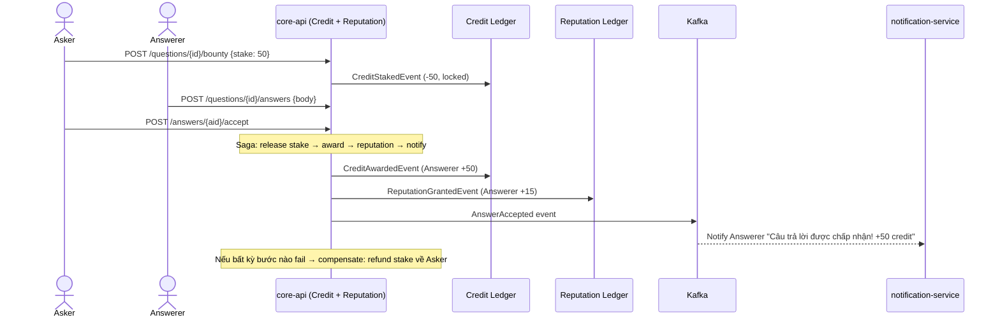
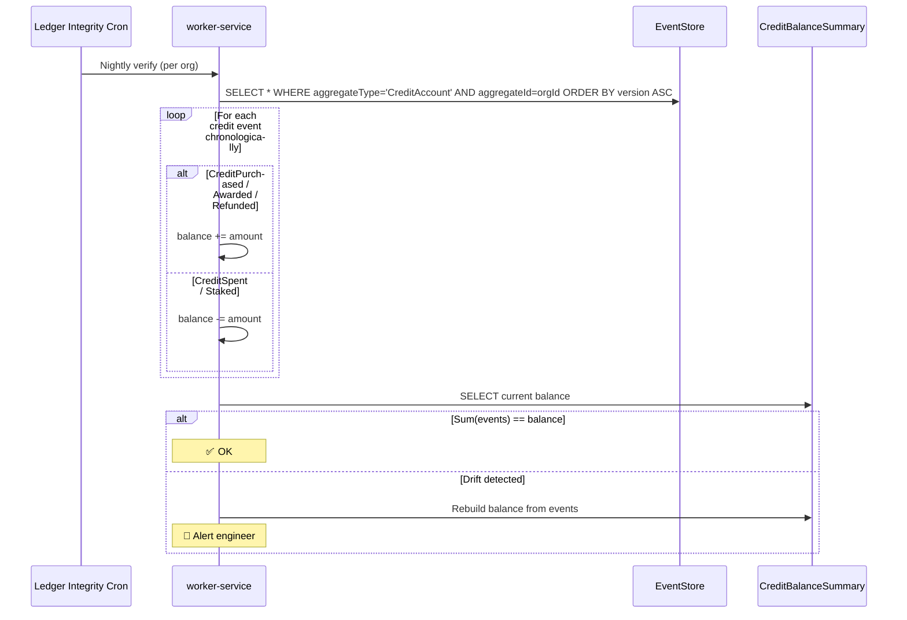

# 🏗️ KIẾN TRÚC HỆ THỐNG & SƠ ĐỒ LUỒNG DỮ LIỆU

> 📖 **[English Version](./en/03_system_architecture_diagrams.md)**

Tài liệu biểu diễn Entity Relationship, Data Flow và Sequence Diagrams cho **Cortex** — kiến trúc Modular Monolith + Event-Driven + AI Discovery (RAG/Hybrid Search).

---

## 1. CORE ENTITY RELATIONSHIP DIAGRAM (ERD)



> **Lưu ý tenant isolation:** mọi bảng nội dung mang `orgId`. Bảng `Embedding` cũng mang `orgId` để **AI Data Boundary** — retrieval luôn lọc theo org, dữ liệu org A không lọt vào ngữ cảnh RAG của org B.

---

## 2. SEQUENCE DIAGRAMS

### Luồng 1: Publish Document (Outbox → Re-index + Re-embed)



---

### Luồng 2: Hỏi AI (RAG) — Saga + Circuit Breaker + Idempotency



---

### Luồng 3: OCC — Đồng biên tập Wiki



---

### Luồng 4: Circuit Breaker — Embedding / AI Provider



---

### Luồng 5: Bounty Saga (gamify đóng góp)



---

### Luồng 6: Event Sourcing — Rebuild Credit Balance (Replay)



---

## 3. HIGH-LEVEL ARCHITECTURE DIAGRAM

```
┌──────────────────────────────────────────────────────────────┐
│                    CLIENT LAYER                              │
│  ┌─────────────────────────────────────────────────────┐     │
│  │  React SPA (Vite)                                   │     │
│  │  ├── Search-first Home (Hybrid + RAG answer)        │     │
│  │  ├── Knowledge Editor (Wiki, OCC, revisions)        │     │
│  │  ├── AI Assistant Chat (RAG, citations)             │     │
│  │  ├── Credit Wallet & Org Admin                      │     │
│  │  └── WebSocket Client (Real-time notifications)     │     │
│  └─────────────────────────────────────────────────────┘     │
└───────────────────────┬──────────────────────────────────────┘
                        │ HTTPS + WebSocket
                        ▼
┌──────────────────────────────────────────────────────────────┐
│                 API GATEWAY / INGRESS (Nginx)               │
│  ├── /api/v1/auth|users|roles|permissions → auth-service     │
│  ├── /api/v1/knowledge|search|spaces|credits|ai → core-api   │
│  └── /ws/*  → notification-service / chat-service            │
└───────────────────────┬──────────────────────────────────────┘
                        │
        ┌───────────────┼───────────────────┐
        ▼               ▼                   ▼
┌──────────────┐ ┌──────────────────┐ ┌─────────────────┐
│ auth-service │ │    core-api      │ │  chat-service    │
│  (Fastify)   │ │   (NestJS)       │ │  (Realtime+AI)   │
│              │ │                  │ │                  │
│ • JWT Auth   │ │ ┌──────────────┐ │ │ • WS threads     │
│ • Refresh    │ │ │tenant-module │ │ │ • AI Assistant   │
│   Rotation   │ │ ├──────────────┤ │ │ • Presence (Redis)│
│ • Org RBAC   │ │ │knowledge-mod │ │ └─────────────────┘
│ • Rate Limit │ │ ├──────────────┤ │
└──────┬───────┘ │ │discovery-mod │ │   ┌──────────────┐
       │         │ │ (Hybrid+RAG) │─┼──▶│  Claude API   │
       ▼         │ ├──────────────┤ │   │ (embed + RAG) │
┌──────────────┐ │ │credit-module │ │   │ via Circuit   │
│  PostgreSQL  │ │ │(Event Source)│ │   │   Breaker     │
│  (auth_db)   │ │ ├──────────────┤ │   └──────────────┘
└──────────────┘ │ │reputation/   │ │
                 │ │ feed (Read)  │ │
                 │ └──────────────┘ │
                 └────────┬─────────┘
                          │
          ┌───────────────┼────────────────┐
          ▼               ▼                ▼
   ┌──────────────┐ ┌──────────┐  ┌──────────────┐
   │ PostgreSQL   │ │  Redis   │  │   Outbox      │
   │ + pgvector   │ │ (Cache)  │  │   Table       │
   │ (core_db)    │ │          │  └──────┬────────┘
   │              │ │ • Feed   │         │ CDC/Polling
   │ • EventStore │ │   Cache  │         ▼
   │ • Knowledge  │ │ • Rate   │  ┌──────────────┐
   │ • Embeddings │ │   Limit  │  │    KAFKA      │
   │ • ReadModels │ │ • Pub/Sub│  │              │
   │ • Idempotency│ │          │  │ Topics:      │
   └──────────────┘ └──────────┘  │ • knowledge-*│
                                  │ • credit-*   │
                                  │ • engage-*   │
                                  │ • *-dlq      │
                                  └──┬───┬───┬───┘
                                     │   │   │
                     ┌───────────────┘   │   └────────────┐
                     ▼                   ▼                ▼
              ┌──────────────┐  ┌──────────────┐  ┌──────────────┐
              │ worker-svc   │  │ notif-svc    │  │ search-svc   │
              │              │  │              │  │              │
              │ • Embeddings │  │ • WebSocket  │  │ • ES Index   │
              │ • Re-index   │  │ • Push Notif │  │ • Full-text  │
              │ • Digest     │  │ • Redis PubSub│ │   Search     │
              │ • Stale Detect│ │              │  │              │
              └──────────────┘  └──────────────┘  └──────────────┘
```

---

## 4. RAG / HYBRID RETRIEVAL DATA FLOW

```
            ┌─────────────── Query (natural language) ───────────────┐
            │                                                        │
            ▼                                                        ▼
   ┌─────────────────┐                                   ┌─────────────────┐
   │  Elasticsearch  │  BM25 full-text (scoped orgId)    │    pgvector     │  cosine sim
   │  top-K keyword  │                                   │  top-K semantic │
   └────────┬────────┘                                   └────────┬────────┘
            │                                                     │
            └──────────────────┬──────────────────────────────────┘
                               ▼
                  ┌─────────────────────────┐
                  │ Reciprocal Rank Fusion  │  (hợp nhất + re-rank)
                  └────────────┬────────────┘
                               ▼
                  ┌─────────────────────────┐
                  │  Build RAG prompt:      │
                  │  context (top-N chunks) │
                  │  + user question        │
                  └────────────┬────────────┘
                               ▼ (Circuit Breaker)
                       ┌───────────────┐
                       │   Claude API  │
                       └───────┬───────┘
                               ▼
                  ┌─────────────────────────┐
                  │ Answer + CITATIONS       │  (links về document nguồn)
                  └─────────────────────────┘
```
