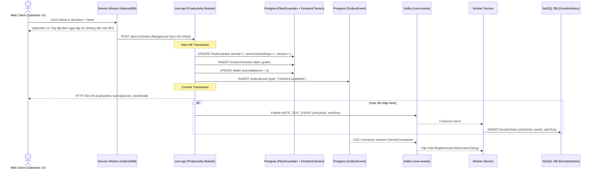
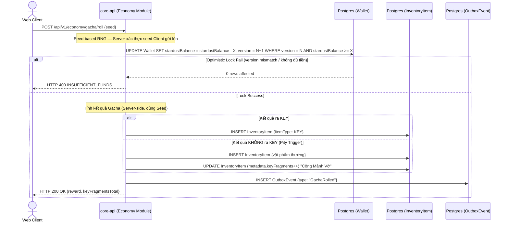
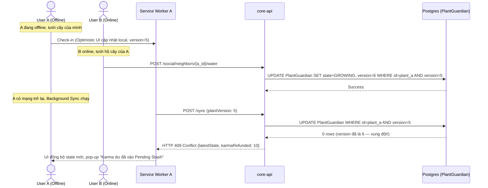
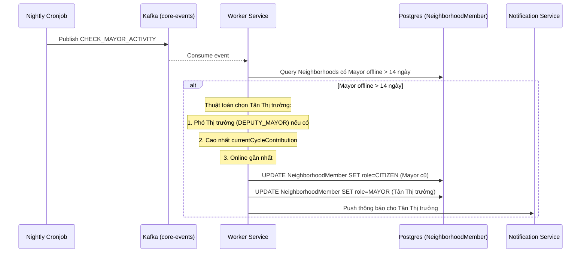
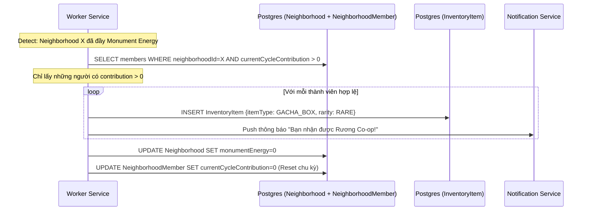

# 🏗️ SYSTEM ARCHITECTURE & TECHNICAL SPECIFICATIONS (GrowthGarden V2)

Tài liệu này biểu diễn Luồng Dữ liệu (Data Flow) và Sơ đồ CSDL (Physical Schema) dựa trên kiến trúc Web-First, Modular Monolith và Event-Driven.

---

## 1. CORE ENTITY RELATIONSHIP DIAGRAM (ERD)

Mô tả sự cô lập dữ liệu theo các Context đã định nghĩa trong lược đồ Prisma. Tuyệt đối không có Foreign Key xuyên Domain để phục vụ tách Microservices trong tương lai.

```mermaid
erDiagram
    %% Identity Context
    User {
        uuid id PK
        string email
        string username
        enum status "ACTIVE, BANNED"
    }
    AuthIdentity {
        uuid id PK
        string userId "Loose ref"
        enum provider "LOCAL, GOOGLE, APPLE"
        string passwordHash
        string refreshToken
    }

    %% Economy Context (wallet-module -> economy-module)
    Wallet {
        uuid id PK
        string userId "Loose ref (no FK)"
        int karmaBalance
        int stardustBalance
        int version "OCC - chống Double Spending"
    }
    InventoryItem {
        uuid id PK
        string userId "Loose ref"
        enum itemType "DECORATION, GACHA_BOX, KEY, KEY_FRAGMENT"
        enum rarity "COMMON, RARE, EPIC, LEGENDARY"
        json metadata "Số lượng mảnh vỡ, asset URL..."
    }

    %% Productivity Context
    PlantGuardian {
        uuid id PK
        string userId "Loose ref"
        enum state "SEED, GROWING, HIBERNATING, DEAD, ANCIENT"
        int currentStreak
        int highestStreak
        int activeCheckinDays "Ngày điểm danh thực tế - chống lách luật"
        int version "OCC - chống Race Condition khi tưới hộ offline"
    }
    EmotionCheckin {
        uuid id PK
        string plantId FK
        date checkinDate
        enum emotionGrade "A, B, C, D, E, F"
    }

    %% Social Context
    Neighborhood {
        uuid id PK
        string name
        int vibeScore
        int monumentEnergy
    }
    NeighborhoodMember {
        string userId "Loose ref"
        string neighborhoodId FK
        enum role "MAYOR, DEPUTY_MAYOR, CITIZEN"
        int currentCycleContribution "Phải > 0 mới nhận Rương Co-op"
    }
    Friendship {
        string userId1 "Loose ref"
        string userId2 "Loose ref"
        enum status "PENDING, ACCEPTED"
    }

    %% Event Sourcing
    OutboxEvent {
        uuid id PK
        string aggregateType "Wallet, PlantGuardian, Neighborhood..."
        string aggregateId
        string eventType "CheckinCompleted, CoopChestRewarded..."
        json payload
        enum status "PENDING, PROCESSED, FAILED_DLQ"
    }

    %% Relationships
    User ||--o{ AuthIdentity : "authenticates via"
    User ||--o| Wallet : "has wallet"
    User ||--o{ InventoryItem : "owns items"
    User ||--o| PlantGuardian : "grows plant"
    PlantGuardian ||--o{ EmotionCheckin : "records checkins"
    User ||--o{ NeighborhoodMember : "lives in"
    Neighborhood ||--o{ NeighborhoodMember : "has members"
```

---

## 2. SEQUENCE DIAGRAMS (LUỒNG DỮ LIỆU CẤP THẤP)

### Luồng 1: Điểm danh Cảm xúc & Cách ly Dữ liệu Text (Outbox + Storage Isolation)
Bảo vệ Transaction Core, đồng thời tách rời Note văn bản sang NoSQL để chống Text Bloat.

---

### Luồng 2: Gacha & Pity System (Chống Double-Spending + Chống RNG Xui Xẻo)
Luồng mua vật phẩm kết hợp Optimistic Locking, Seed-based RNG và tích lũy Pity Fragment.

---

### Luồng 3: OCC khi Đồng bộ Offline (Tưới hộ vs. Self Check-in)
Xử lý xung đột dữ liệu khi bạn bè tưới cây lúc User đang Offline.

---

### Luồng 4: Auto-Transfer Quyền Thị Trưởng (Mayor Auto-Transfer)
Tự động chuyển giao quyền lực khi Thị trưởng offline quá 14 ngày.

---

### Luồng 5: Chống Ký sinh — Phân phối Rương Co-op (Monument Chest)
Đảm bảo chỉ thành viên có đóng góp mới được nhận Rương khi Monument đầy năng lượng.

