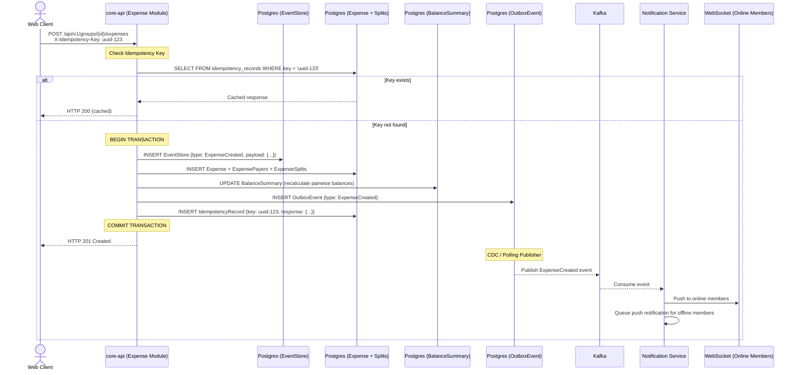
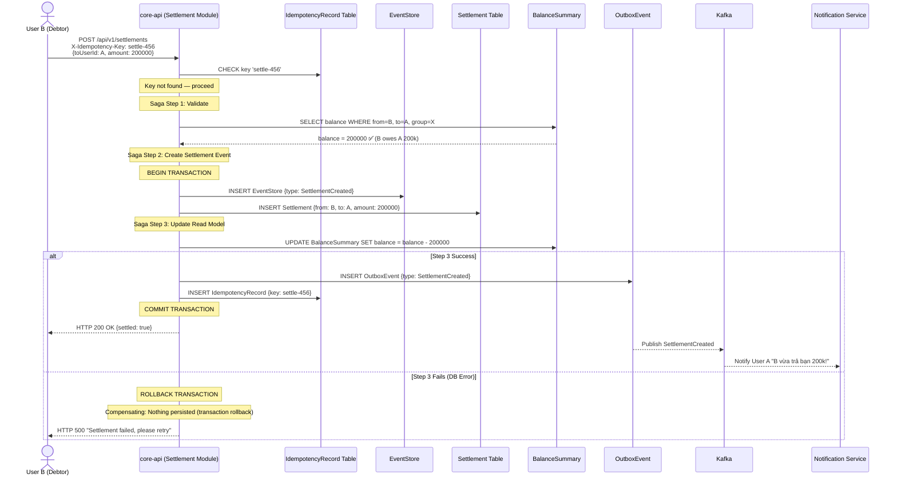
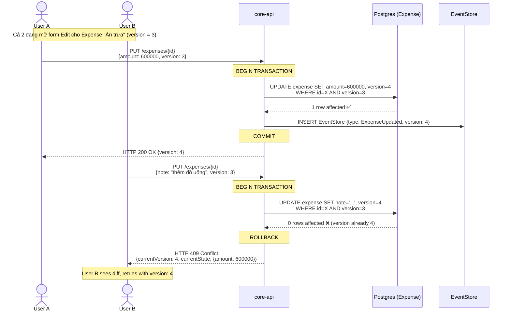
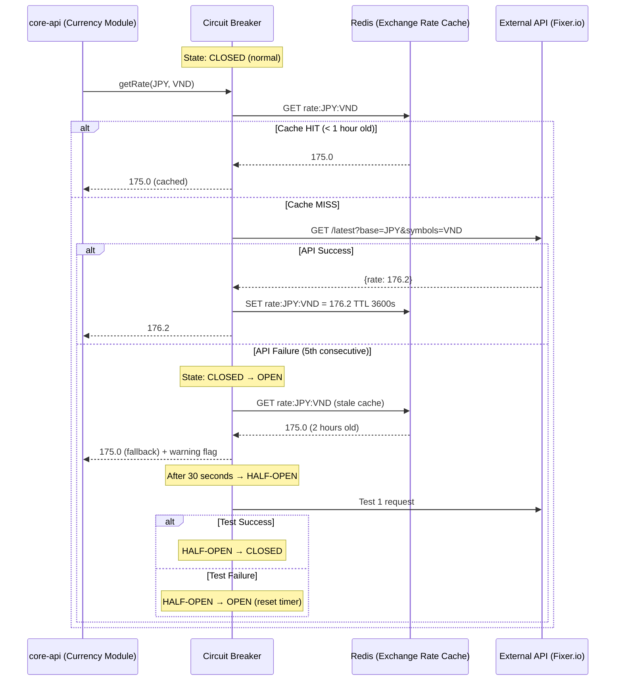
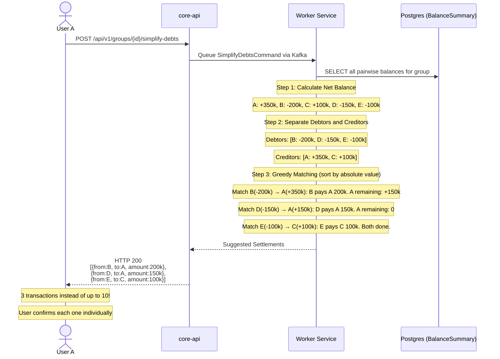
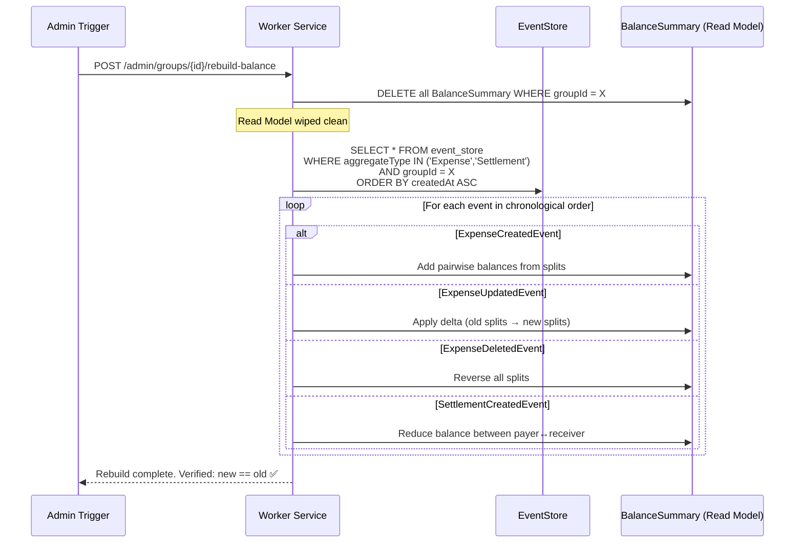

# 🏗️ KIẾN TRÚC HỆ THỐNG & SƠ ĐỒ LUỒNG DỮ LIỆU

> 📖 **[English Version](./en/03_system_architecture_diagrams.md)**

Tài liệu biểu diễn Entity Relationship, Data Flow và Sequence Diagrams cho kiến trúc Modular Monolith + Event-Driven.

---

## 1. CORE ENTITY RELATIONSHIP DIAGRAM (ERD)

```mermaid
erDiagram
    %% Identity Context (auth-service DB)
    User {
        uuid id PK
        string email
        string username
        string avatarUrl
        enum status "ACTIVE, BANNED"
    }
    AuthIdentity {
        uuid id PK
        string userId "Loose ref"
        enum provider "LOCAL, GOOGLE"
        string passwordHash
        string refreshToken
    }

    %% Group Context
    FinanceGroup {
        uuid id PK
        string name
        string description
        enum type "PERSISTENT, TRIP, QUICK_SPLIT"
        enum status "ACTIVE, SETTLED, ARCHIVED"
        string baseCurrency "VND, USD, EUR..."
        date startDate
        date endDate
        int version "OCC"
    }
    GroupMember {
        uuid id PK
        string userId "Loose ref - no FK"
        string groupId FK
        enum role "OWNER, ADMIN, MEMBER, VIEWER"
        datetime joinedAt
    }
    GroupInvite {
        uuid id PK
        string groupId FK
        string inviteCode "UNIQUE"
        string invitedByUserId
        datetime expiresAt
    }

    %% Expense Context (Write Model)
    Expense {
        uuid id PK
        string groupId "Loose ref"
        string description
        int totalAmount "Stored in smallest unit"
        string currency
        decimal exchangeRate "Pinned at creation"
        int convertedAmount "In base currency"
        enum splitMethod "EQUAL, EXACT, PERCENTAGE, SHARES"
        enum category "FOOD, TRANSPORT..."
        string noteText
        string receiptUrl
        date expenseDate
        boolean isDeleted "Soft delete"
        int version "OCC"
        datetime createdAt
        string createdByUserId "Loose ref"
    }
    ExpensePayer {
        uuid id PK
        string expenseId FK
        string userId "Loose ref"
        int amount "Amount this payer paid"
    }
    ExpenseSplit {
        uuid id PK
        string expenseId FK
        string userId "Loose ref"
        int amount "Amount this user owes"
        decimal percentage "If PERCENTAGE split"
        int shares "If SHARES split"
    }

    %% Settlement Context
    Settlement {
        uuid id PK
        string groupId "Loose ref"
        string fromUserId "Loose ref - person paying"
        string toUserId "Loose ref - person receiving"
        int amount
        string currency
        decimal exchangeRate
        int convertedAmount
        enum type "FULL, PARTIAL, RECORD_ONLY"
        datetime createdAt
        string createdByUserId
    }

    %% Event Store (Event Sourcing)
    EventStore {
        uuid id PK
        string aggregateType "Expense, Settlement, Group"
        string aggregateId
        string eventType "ExpenseCreated, SettlementCreated..."
        int version "Per aggregate"
        json payload
        string userId "Who triggered"
        datetime createdAt
    }

    %% Balance Read Model (CQRS)
    BalanceSummary {
        uuid id PK
        string groupId "Loose ref"
        string fromUserId "Person who owes"
        string toUserId "Person who is owed"
        int balance "Positive = fromUser owes toUser"
        string currency "Base currency of group"
        datetime updatedAt
    }

    %% Infrastructure
    OutboxEvent {
        uuid id PK
        string aggregateType
        string aggregateId
        string eventType
        json payload
        enum status "PENDING, PROCESSED, FAILED_DLQ"
        datetime createdAt
        datetime processedAt
    }
    IdempotencyRecord {
        string key PK "X-Idempotency-Key"
        json response "Cached response"
        datetime createdAt
        datetime expiresAt
    }

    %% Relationships
    User ||--o{ AuthIdentity : "authenticates via"
    User ||--o{ GroupMember : "belongs to groups"
    FinanceGroup ||--o{ GroupMember : "has members"
    FinanceGroup ||--o{ GroupInvite : "has invites"
    Expense ||--o{ ExpensePayer : "paid by"
    Expense ||--o{ ExpenseSplit : "split among"
```



---

## 2. SEQUENCE DIAGRAMS

### Luồng 1: Tạo Expense (Outbox + Event Sourcing + Notification)



---

### Luồng 2: Settlement — Saga Pattern + Idempotency



---

### Luồng 3: OCC — Xung đột Sửa Expense Đồng thời



---

### Luồng 4: Circuit Breaker — Exchange Rate API



---

### Luồng 5: Debt Simplification Algorithm



---

### Luồng 6: Event Sourcing — Rebuild Balance (Replay)



---

## 3. HIGH-LEVEL ARCHITECTURE DIAGRAM

```
┌──────────────────────────────────────────────────────────────┐
│                    CLIENT LAYER                              │
│  ┌─────────────────────────────────────────────────────┐     │
│  │  React SPA (Vite)                                   │     │
│  │  ├── Dashboard (Charts, Balances)                   │     │
│  │  ├── Expense Forms (Create/Edit)                    │     │
│  │  ├── Settlement Flow                                │     │
│  │  ├── Group Management                               │     │
│  │  └── WebSocket Client (Real-time updates)           │     │
│  └─────────────────────────────────────────────────────┘     │
└───────────────────────┬──────────────────────────────────────┘
                        │ HTTPS + WebSocket
                        ▼
┌──────────────────────────────────────────────────────────────┐
│                 API GATEWAY / INGRESS                        │
│  ├── /auth/*        → auth-service (Fastify :3001)           │
│  ├── /api/v1/*      → core-api (NestJS :3000)                │
│  ├── /ws/*          → notification-service (:3004)           │
│  └── /exchange/*    → exchange-rate-service (:3005)           │
└───────────────────────┬──────────────────────────────────────┘
                        │
        ┌───────────────┼───────────────────┐
        ▼               ▼                   ▼
┌──────────────┐ ┌──────────────────┐ ┌─────────────────┐
│ auth-service │ │    core-api      │ │ exchange-rate    │
│  (Fastify)   │ │   (NestJS)       │ │   -service       │
│              │ │                  │ │                  │
│ • JWT Auth   │ │ ┌──────────────┐ │ │ • Circuit Breaker│
│ • Refresh    │ │ │ group-module │ │ │ • Rate Caching   │
│   Rotation   │ │ ├──────────────┤ │ │ • Fallback       │
│ • Rate Limit │ │ │expense-module│ │ └──────┬──────────┘
└──────┬───────┘ │ ├──────────────┤ │        │
       │         │ │settle-module │ │        ▼
       ▼         │ ├──────────────┤ │  ┌──────────────┐
┌──────────────┐ │ │balance-module│ │  │ Fixer.io /   │
│  PostgreSQL  │ │ │ (Read Model) │ │  │ ExchangeRate │
│  (Auth DB)   │ │ ├──────────────┤ │  │  (3rd-party) │
└──────────────┘ │ │currency-mod  │ │  └──────────────┘
                 │ └──────────────┘ │
                 └────────┬─────────┘
                          │
          ┌───────────────┼────────────────┐
          ▼               ▼                ▼
   ┌──────────────┐ ┌──────────┐  ┌──────────────┐
   │  PostgreSQL  │ │  Redis   │  │   Outbox      │
   │  (Core DB)   │ │ (Cache)  │  │   Table       │
   │              │ │          │  └──────┬────────┘
   │ • EventStore │ │ • Balance│         │ CDC/Polling
   │ • Expenses   │ │   Cache  │         ▼
   │ • Settlements│ │ • Rate   │  ┌──────────────┐
   │ • Balances   │ │   Cache  │  │    KAFKA      │
   │ • Idempotency│ │ • Pub/Sub│  │              │
   └──────────────┘ └──────────┘  │ Topics:      │
                                  │ • expense-*  │
                                  │ • settle-*   │
                                  │ • group-*    │
                                  │ • *-dlq      │
                                  └──┬───┬───┬───┘
                                     │   │   │
                     ┌───────────────┘   │   └────────────┐
                     ▼                   ▼                ▼
              ┌──────────────┐  ┌──────────────┐  ┌──────────────┐
              │ worker-svc   │  │ notif-svc    │  │ search-svc   │
              │              │  │              │  │              │
              │ • Debt Simplify│ │ • WebSocket  │  │ • ES Index   │
              │ • Ledger Check│  │ • Push Notif │  │ • Full-text  │
              │ • Export PDF  │  │ • Redis PubSub│ │   Search     │
              │ • Auto-Archive│  │              │  │              │
              └──────────────┘  └──────────────┘  └──────────────┘
```
