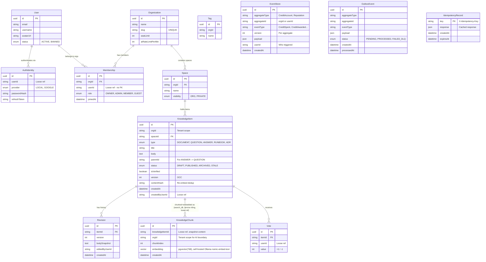
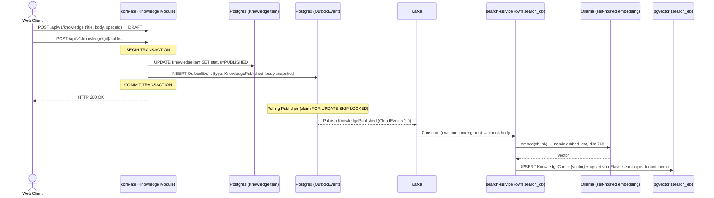
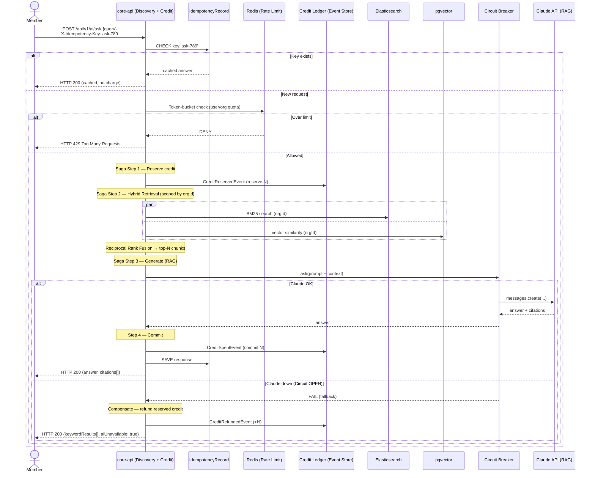
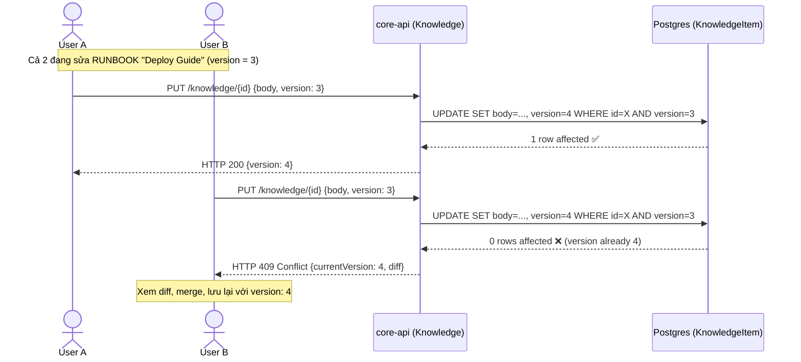
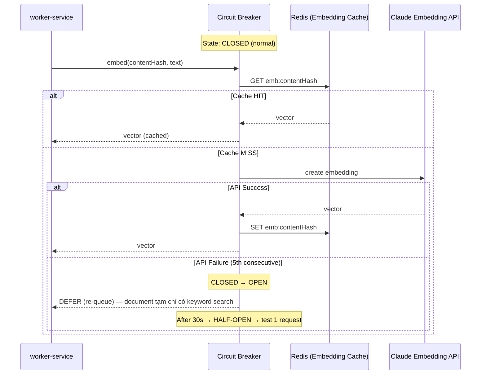
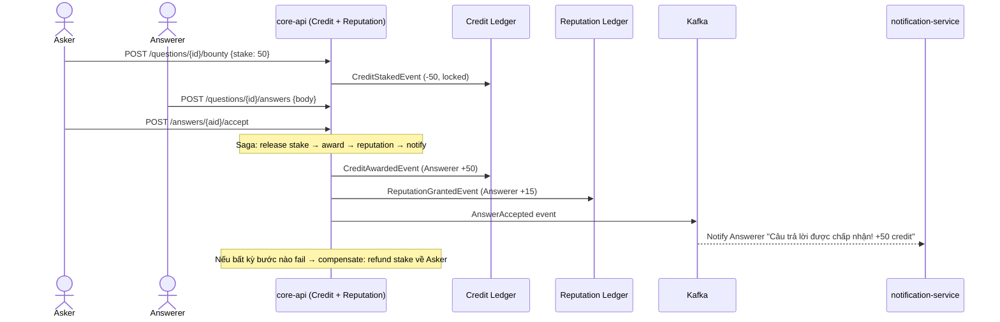
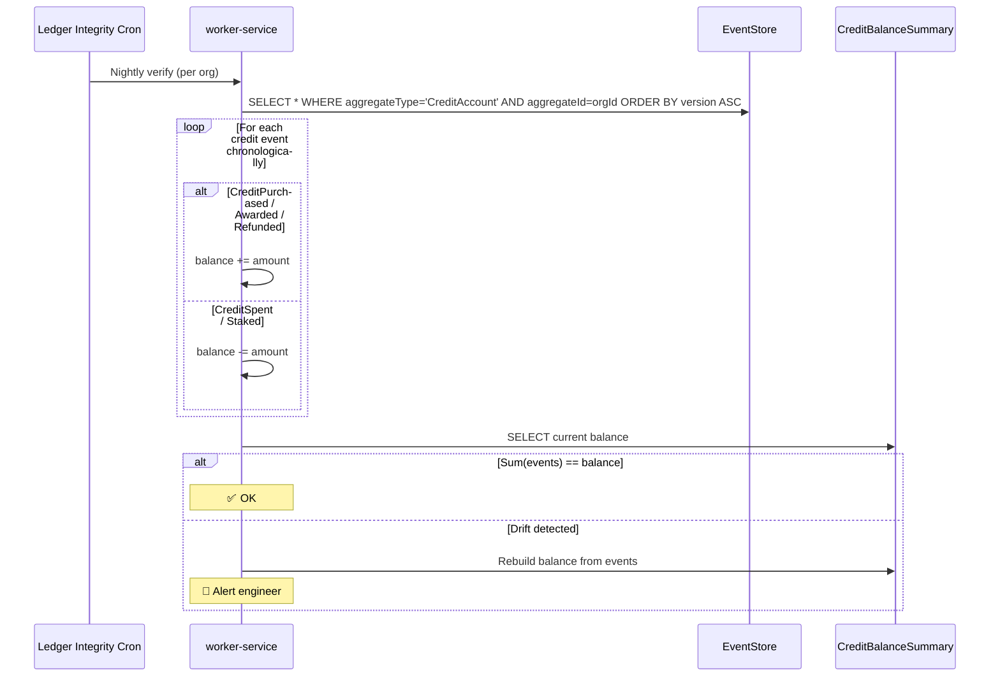

# 🏗️ KIẾN TRÚC HỆ THỐNG & SƠ ĐỒ LUỒNG DỮ LIỆU


Tài liệu biểu diễn Entity Relationship, Data Flow và Sequence Diagrams cho **Cortex** — kiến trúc Modular Monolith (core-api) + Microservices (auth/notification/search) + Event-Driven + AI Discovery (RAG/Hybrid Search).

> ⚠️ **Trạng thái tài liệu (audit 2026-07-21):** một số sơ đồ dưới đây vẽ **kiến trúc mục tiêu** (Saga AI-Query có reserve/commit/compensate credit, Bounty Saga, cron rebuild balance qua worker-service) — các phần này **CHƯA triển khai** (Phase 5b/5c chưa bắt đầu). Thực tế hiện tại: search-service tự làm hybrid+RAG trong 1 request đồng bộ (không saga, không trừ credit — `POST /api/v1/search`); `worker-service` là **scaffold rỗng**, không có consumer/cron nào chạy; không có WebSocket/`chat-service` nào tồn tại. Chi tiết chính xác nhất luôn là `docs/04` (schema) + `docs/06` (API) + `.ai/PROJECT_STATUS.md`, không phải sequence diagram bên dưới.

---

## 1. CORE ENTITY RELATIONSHIP DIAGRAM (ERD)


```mermaid
erDiagram
    %% Identity Context (auth-service DB)
    User {
        uuid id PK
        string email
        string username
        string avatarUrl
        enum status "ACTIVE, BANNED"
    }
    AuthIdentity {
        uuid id PK
        string userId "Loose ref"
        enum provider "LOCAL, GOOGLE"
        string passwordHash
        string refreshToken
    }

    %% Tenant Context (core-api DB)
    Organization {
        uuid id PK
        string name
        string slug "UNIQUE"
        int seatLimit
        int aiRateLimitPerMin
    }
    Membership {
        uuid id PK
        string orgId FK
        string userId "Loose ref - no FK"
        enum role "OWNER, ADMIN, MEMBER, GUEST"
        datetime joinedAt
    }
    Space {
        uuid id PK
        string orgId FK
        string name
        enum visibility "ORG, PRIVATE"
    }

    %% Knowledge Context (Write Model)
    KnowledgeItem {
        uuid id PK
        string orgId "Tenant scope"
        string spaceId FK
        enum type "DOCUMENT, QUESTION, ANSWER, RUNBOOK, ADR"
        string title
        text body
        string parentId "For ANSWER -> QUESTION"
        enum status "DRAFT, PUBLISHED, ARCHIVED, STALE"
        boolean isVerified
        int version "OCC"
        string contentHash "Re-embed dedup"
        datetime createdAt
        string createdByUserId "Loose ref"
    }
    Revision {
        uuid id PK
        string itemId FK
        int version
        text bodySnapshot
        string editedByUserId
        datetime createdAt
    }
    Tag {
        uuid id PK
        string orgId
        string name
    }

    %% Discovery Context — search-service, own search_db (KHÔNG còn ở core_db, xem docs/04 §2.4)
    KnowledgeChunk {
        uuid id PK
        string knowledgeItemId "Loose ref, snapshot content"
        string orgId "Tenant scope for AI boundary"
        int chunkIndex
        vector embedding "pgvector(768), self-hosted Ollama nomic-embed-text"
        datetime createdAt
    }

    %% Engagement Context
    Vote {
        uuid id PK
        string itemId FK
        string userId "Loose ref"
        int value "+1 / -1"
    }

    %% Credit Context (Event Sourcing)
    EventStore {
        uuid id PK
        string aggregateType "CreditAccount, Reputation"
        string aggregateId "orgId or userId"
        string eventType "CreditSpent, CreditAwarded..."
        int version "Per aggregate"
        json payload
        string userId "Who triggered"
        datetime createdAt
    }
    %% KHÔNG có bảng summary — balance fold-on-read trực tiếp từ EventStore
    %% (CreditBalanceSummary bị rollback 2026-06-30, xem docs/04 §2.7)

    %% Infrastructure
    OutboxEvent {
        uuid id PK
        string aggregateType
        string aggregateId
        string eventType
        json payload
        enum status "PENDING, PROCESSED, FAILED_DLQ"
        datetime createdAt
        datetime processedAt
    }
    IdempotencyRecord {
        string key PK "X-Idempotency-Key"
        json response "Cached response"
        datetime createdAt
        datetime expiresAt
    }

    %% Relationships
    User ||--o{ AuthIdentity : "authenticates via"
    User ||--o{ Membership : "belongs to orgs"
    Organization ||--o{ Membership : "has members"
    Organization ||--o{ Space : "contains spaces"
    Space ||--o{ KnowledgeItem : "holds items"
    KnowledgeItem ||--o{ Revision : "has history"
    KnowledgeItem ||--o{ KnowledgeChunk : "chunked+embedded as (search_db, service riêng, loose ref)"
    KnowledgeItem ||--o{ Vote : "receives"
```

> **Lưu ý tenant isolation:** mọi bảng nội dung mang `orgId`. `KnowledgeChunk` (search_db, service riêng — KHÔNG còn ở core_db) cũng mang `orgId` để **AI Data Boundary** — retrieval luôn lọc theo org, dữ liệu org A không lọt vào ngữ cảnh RAG của org B.

---

## 2. SEQUENCE DIAGRAMS

### Luồng 1: Publish Document (Outbox → Re-index + Re-embed)

> ✅ **Sơ đồ này khớp code thật** (đã sửa lại đúng theo audit — trước đây có 2 lỗi: dùng `POST /knowledge` để publish luôn (thực tế cần `POST /knowledge/{id}/publish` riêng), và cho `worker-service` làm việc re-embed (thực tế đó là `search-service`, dùng Ollama tự host chứ không phải Claude embedding API — Claude không có embeddings API).


```mermaid
sequenceDiagram
    actor User as Web Client
    participant API as core-api (Knowledge Module)
    participant DB as Postgres (KnowledgeItem)
    participant Outbox as Postgres (OutboxEvent)
    participant Kafka as Kafka
    participant Search as search-service (own search_db)
    participant Ollama as Ollama (self-hosted embedding)
    participant PG as pgvector (search_db)

    User->>API: POST /api/v1/knowledge (title, body, spaceId) → DRAFT
    User->>API: POST /api/v1/knowledge/{id}/publish

    Note over API: BEGIN TRANSACTION
    API->>DB: UPDATE KnowledgeItem SET status=PUBLISHED
    API->>Outbox: INSERT OutboxEvent {type: KnowledgePublished, body snapshot}
    Note over API: COMMIT TRANSACTION
    API-->>User: HTTP 200 OK

    Note over Outbox: Polling Publisher (claim FOR UPDATE SKIP LOCKED)
    Outbox-->>Kafka: Publish KnowledgePublished (CloudEvents 1.0)
    Kafka-->>Search: Consume (own consumer group) → chunk body
    Search->>Ollama: embed(chunk) — nomic-embed-text, dim 768
    Ollama-->>Search: vector
    Search->>PG: UPSERT KnowledgeChunk {vector} + upsert vào Elasticsearch (per-tenant index)
```

---

### Luồng 2: Hỏi AI (RAG) — Saga + Circuit Breaker + Idempotency

> ⚠️ **Target design, CHƯA triển khai (Phase 5b, chưa bắt đầu).** Endpoint thật hiện tại là `POST /api/v1/search` (search-service, đồng bộ, 1 request — không reserve/commit credit, không saga, không idempotency-key). Xem `docs/06` §5.


```mermaid
sequenceDiagram
    actor User as Member
    participant API as core-api (Discovery + Credit)
    participant Idem as IdempotencyRecord
    participant RL as Redis (Rate Limit)
    participant Credit as Credit Ledger (Event Store)
    participant ES as Elasticsearch
    participant PG as pgvector
    participant CB as Circuit Breaker
    participant Claude as Claude API (RAG)

    User->>API: POST /api/v1/ai/ask {query}<br/>X-Idempotency-Key: ask-789

    API->>Idem: CHECK key 'ask-789'
    alt Key exists
        Idem-->>API: cached answer
        API-->>User: HTTP 200 (cached, no charge)
    else New request
        API->>RL: Token-bucket check (user/org quota)
        alt Over limit
            RL-->>API: DENY
            API-->>User: HTTP 429 Too Many Requests
        else Allowed
            Note over API: Saga Step 1 — Reserve credit
            API->>Credit: CreditReservedEvent (reserve N)

            Note over API: Saga Step 2 — Hybrid Retrieval (scoped by orgId)
            par
                API->>ES: BM25 search (orgId)
            and
                API->>PG: vector similarity (orgId)
            end
            Note over API: Reciprocal Rank Fusion → top-N chunks

            Note over API: Saga Step 3 — Generate (RAG)
            API->>CB: ask(prompt + context)
            alt Claude OK
                CB->>Claude: messages.create(...)
                Claude-->>CB: answer + citations
                CB-->>API: answer
                Note over API: Step 4 — Commit
                API->>Credit: CreditSpentEvent (commit N)
                API->>Idem: SAVE response
                API-->>User: HTTP 200 {answer, citations[]}
            else Claude down (Circuit OPEN)
                CB-->>API: FAIL (fallback)
                Note over API: Compensate — refund reserved credit
                API->>Credit: CreditRefundedEvent (+N)
                API-->>User: HTTP 200 {keywordResults[], aiUnavailable: true}
            end
        end
    end
```

---

### Luồng 3: OCC — Đồng biên tập Wiki


```mermaid
sequenceDiagram
    actor UserA as User A
    actor UserB as User B
    participant API as core-api (Knowledge)
    participant DB as Postgres (KnowledgeItem)

    Note over UserA,UserB: Cả 2 đang sửa RUNBOOK "Deploy Guide" (version = 3)

    UserA->>API: PUT /knowledge/{id} {body, version: 3}
    API->>DB: UPDATE SET body=..., version=4 WHERE id=X AND version=3
    DB-->>API: 1 row affected ✅
    API-->>UserA: HTTP 200 {version: 4}

    UserB->>API: PUT /knowledge/{id} {body, version: 3}
    API->>DB: UPDATE SET body=..., version=4 WHERE id=X AND version=3
    DB-->>API: 0 rows affected ❌ (version already 4)
    API-->>UserB: HTTP 409 Conflict {currentVersion: 4, diff}

    Note over UserB: Xem diff, merge, lưu lại với version: 4
```

---

### Luồng 4: Circuit Breaker — Embedding / AI Provider


```mermaid
sequenceDiagram
    participant W as worker-service
    participant CB as Circuit Breaker
    participant Cache as Redis (Embedding Cache)
    participant Claude as Claude Embedding API

    Note over CB: State: CLOSED (normal)
    W->>CB: embed(contentHash, text)
    CB->>Cache: GET emb:contentHash
    alt Cache HIT
        Cache-->>CB: vector
        CB-->>W: vector (cached)
    else Cache MISS
        CB->>Claude: create embedding
        alt API Success
            Claude-->>CB: vector
            CB->>Cache: SET emb:contentHash
            CB-->>W: vector
        else API Failure (5th consecutive)
            Note over CB: CLOSED → OPEN
            CB-->>W: DEFER (re-queue) — document tạm chỉ có keyword search
            Note over CB: After 30s → HALF-OPEN → test 1 request
        end
    end
```

---

### Luồng 5: Bounty Saga (gamify đóng góp)

> ⚠️ **Target design, CHƯA triển khai (Phase 5c, chưa bắt đầu).** Không có endpoint `/bounty` hay `/answers` nào tồn tại; `reputation_events` ledger đã có trong schema nhưng chưa được ghi ở đâu cả.


```mermaid
sequenceDiagram
    actor Asker as Asker
    actor Answerer as Answerer
    participant API as core-api (Credit + Reputation)
    participant Credit as Credit Ledger
    participant Rep as Reputation Ledger
    participant Kafka as Kafka
    participant Notif as notification-service

    Asker->>API: POST /questions/{id}/bounty {stake: 50}
    API->>Credit: CreditStakedEvent (-50, locked)

    Answerer->>API: POST /questions/{id}/answers {body}
    Asker->>API: POST /answers/{aid}/accept

    Note over API: Saga: release stake → award → reputation → notify
    API->>Credit: CreditAwardedEvent (Answerer +50)
    API->>Rep: ReputationGrantedEvent (Answerer +15)
    API->>Kafka: AnswerAccepted event
    Kafka-->>Notif: Notify Answerer "Câu trả lời được chấp nhận! +50 credit"

    Note over API: Nếu bất kỳ bước nào fail → compensate: refund stake về Asker
```

---

### Luồng 6: Event Sourcing — Rebuild Credit Balance (Replay)

> ⚠️ **Target design, CHƯA triển khai.** Không có cron/worker nào — `worker-service` là scaffold rỗng (xem lưu ý §3). Thực tế hiện tại: balance **fold-on-read** trực tiếp trong `GET /credits/wallet` (core-api) mỗi lần gọi, không có `CreditBalanceSummary` để so khớp/rebuild (xem `docs/04` §2.7). Sơ đồ dưới mô tả ý tưởng ledger-integrity-check cho tương lai nếu cần optimize.


```mermaid
sequenceDiagram
    participant Cron as Ledger Integrity Cron
    participant Worker as worker-service
    participant ES as EventStore
    participant RM as CreditBalanceSummary

    Cron->>Worker: Nightly verify (per org)
    Worker->>ES: SELECT * WHERE aggregateType='CreditAccount' AND aggregateId=orgId ORDER BY version ASC

    loop For each credit event chronologically
        alt CreditPurchased / Awarded / Refunded
            Worker->>Worker: balance += amount
        else CreditSpent / Staked
            Worker->>Worker: balance -= amount
        end
    end

    Worker->>RM: SELECT current balance
    alt Sum(events) == balance
        Note over Worker: ✅ OK
    else Drift detected
        Worker->>RM: Rebuild balance from events
        Note over Worker: 🚨 Alert engineer
    end
```

---

## 3. HIGH-LEVEL ARCHITECTURE DIAGRAM

```
┌──────────────────────────────────────────────────────────────┐
│                    CLIENT LAYER                              │
│  ┌─────────────────────────────────────────────────────┐     │
│  │  React SPA (Vite)                                   │     │
│  │  ├── Search-first Home (Hybrid + RAG answer)        │     │
│  │  ├── Knowledge Editor (Wiki, OCC, revisions)        │     │
│  │  ├── Credit Wallet & Org Admin (System + Org RBAC)  │     │
│  │  └── Notifications (REST polling — KHÔNG WebSocket) │     │
│  └─────────────────────────────────────────────────────┘     │
└───────────────────────┬──────────────────────────────────────┘
                        │ HTTPS (không có kênh WebSocket nào — xem docs/06 §8)
                        ▼
┌──────────────────────────────────────────────────────────────┐
│                 API GATEWAY / INGRESS (Nginx)               │
│  ├── /api/v1/auth|users|roles|permissions → auth-service :4001│
│  ├── /api/v1/search → search-service :4004                   │
│  ├── /api/v1/notifications → notification-service :4003      │
│  └── /api/v1/orgs|spaces|invites|knowledge|follows|bookmarks│
│      |credits|feed|admin → core-api :4002                    │
└───────────────────────┬──────────────────────────────────────┘
                        │
        ┌───────────┬───┴───────┬───────────────┐
        ▼           ▼           ▼               ▼
┌──────────────┐ ┌──────────┐ ┌────────────┐ ┌──────────────┐
│ auth-service │ │ core-api │ │notification-│ │search-service│
│  (Fastify)   │ │ (NestJS) │ │  service   │ │  (NestJS)    │
│              │ │          │ │  (NestJS)  │ │              │
│ • JWT Auth   │ │tenant    │ │• GET list  │ │• Hybrid RRF  │
│ • System RBAC│ │knowledge │ │• PATCH read│ │  (ES+pgvector)│
│ • Refresh    │ │engagement│ │• REST only,│ │• RAG summary │
│   Rotation   │ │feed      │ │  no WS     │ │  (Claude, CB)│
└──────┬───────┘ │credit    │ └─────┬──────┘ └──────┬───────┘
       │         │(EventSrc)│       │               │  ▲
       ▼         │platform- │       │               │  │ Claude API
┌──────────────┐ │  admin   │       │               │  │ (Circuit Breaker)
│  PostgreSQL  │ │(gRPC saga)│      │               │
│  (auth_db)   │ └────┬─────┘       │               │
└──────────────┘      │             │               │
                       ▼             ▼               ▼
                ┌──────────────┐ ┌──────────┐  ┌──────────────┐
                │ PostgreSQL   │ │PostgreSQL│  │ PostgreSQL   │
                │ (core_db)    │ │(notif_db)│  │ + pgvector   │
                │ • EventStore │ │•Notif    │  │ (search_db)  │
                │   (credit/   │ │•SpaceFol-│  │ •Knowledge   │
                │   reputation)│ │  lower   │  │   Chunk      │
                │ • Knowledge  │ └──────────┘  └──────────────┘
                │ • Outbox     │
                │ • Idempotency│      Redis, Kafka, Elasticsearch: xem docs/09
                └──────┬───────┘      cho danh sách hạ tầng + trạng thái dùng thật
                       │ CDC/Polling Publisher
                       ▼
                ┌──────────────┐
                │    KAFKA     │  Topics thật: knowledge-events, engagement-events
                │  (KRaft)     │  + <topic>.DLQ. KHÔNG có credit-events consumer nào
                └──┬───┬───────┘  (Kafka emit cho credit defer tới Phase 5c).
                   │   │
        ┌──────────┘   └──────────┐
        ▼                         ▼
┌──────────────┐          ┌──────────────┐
│notification- │          │search-service │
│  service     │          │  (2nd consumer│
│ (consumer 1) │          │   group)      │
│ fan-out notify│         │ index chunk + │
└──────────────┘          │ embed on publish│
                           └──────────────┘

worker-service: SCAFFOLD RỖNG — không consume Kafka, không cron, không HTTP.
Trước đây làm Embeddings/Re-index/Digest/Stale-detect nhưng bị ROLLBACK
2026-06-30 cùng read-model. Hiện chỉ mirror type-gen `Follow` (đọc, không ghi).
```

---

## 4. RAG / HYBRID RETRIEVAL DATA FLOW

```
            ┌─────────────── Query (natural language) ───────────────┐
            │                                                        │
            ▼                                                        ▼
   ┌─────────────────┐                                   ┌─────────────────┐
   │  Elasticsearch  │  BM25 full-text (scoped orgId)    │    pgvector     │  cosine sim
   │  top-K keyword  │                                   │  top-K semantic │
   └────────┬────────┘                                   └────────┬────────┘
            │                                                     │
            └──────────────────┬──────────────────────────────────┘
                               ▼
                  ┌─────────────────────────┐
                  │ Reciprocal Rank Fusion  │  (hợp nhất + re-rank)
                  └────────────┬────────────┘
                               ▼
                  ┌─────────────────────────┐
                  │  Build RAG prompt:      │
                  │  context (top-N chunks) │
                  │  + user question        │
                  └────────────┬────────────┘
                               ▼ (Circuit Breaker)
                       ┌───────────────┐
                       │   Claude API  │
                       └───────┬───────┘
                               ▼
                  ┌─────────────────────────┐
                  │ Answer + CITATIONS       │  (links về document nguồn)
                  └─────────────────────────┘
```
